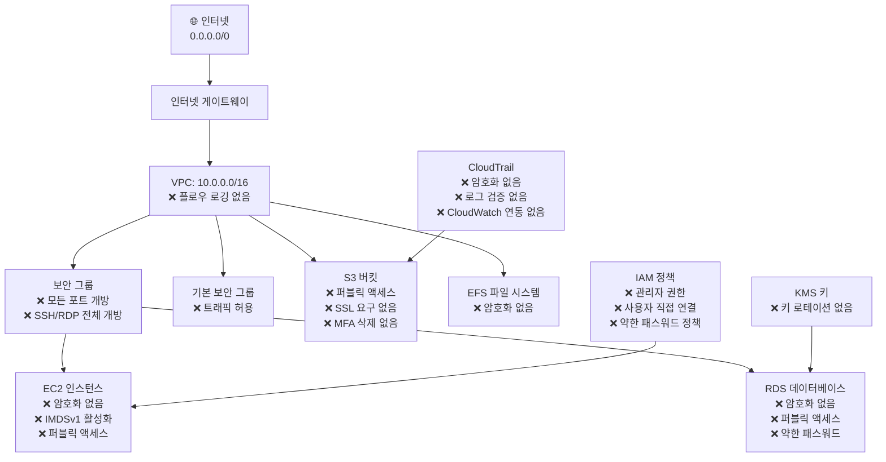

# 🚨 취약한 AWS 인프라 데모

> **⚠️ 경고: 이 저장소는 교육 및 테스트 목적으로 의도적으로 취약한 인프라 코드를 포함하고 있습니다. 절대 프로덕션 환경에서 사용하지 마세요!**

이 저장소는 HCP Terraform에서 Sentinel 정책 기반 가드레일의 효과를 보여주기 위해 다양한 AWS 보안 취약점과 잘못된 구성을 시연합니다.

## 📋 개요

이 프로젝트는 AWS와 HashiCorp가 공동으로 개발한 Sentinel 보안 정책을 테스트하고 검증하기 위해 의도적으로 안전하지 않은 AWS 인프라를 생성합니다. 인프라에는 네트워킹, 암호화, 접근 제어 및 규정 준수 영역에 걸친 여러 보안 위반 사항이 포함되어 있습니다.

## 🏗️ 아키텍처

취약한 인프라는 다음 구성 요소들을 포함합니다:



## 🎯 보안 위반 사항

### 🔴 치명적 취약점 (Hard Mandatory)

| 구성 요소 | 위반 사항 | 위험도 | 영향 |
|-----------|-----------|------------|---------|
| **보안 그룹** | SSH (22) & RDP (3389) 포트를 0.0.0.0/0에 개방 | 🔴 치명적 | 즉시 침해 위험 |
| **IAM 정책** | 관리자 권한 (*:*) 부여 | 🔴 치명적 | 전체 AWS 계정 탈취 |
| **S3 버킷** | 퍼블릭 액세스 활성화 | 🔴 치명적 | 데이터 유출 및 노출 |

### 🟡 중요한 문제 (Soft Mandatory)

| 구성 요소 | 위반 사항 | 위험도 | 영향 |
|-----------|-----------|------------|---------|
| **RDS** | 스토리지 암호화 비활성화 | 🟡 높음 | 저장 데이터 노출 |
| **EBS 볼륨** | 암호화 비활성화 | 🟡 높음 | 디스크 데이터 노출 |
| **EC2 인스턴스** | IMDSv2 미적용 | 🟡 높음 | SSRF 공격 벡터 |
| **네트워크** | 기본 보안 그룹 트래픽 허용 | 🟡 높음 | 의도치 않은 접근 |

### 🟢 규정 준수 문제 (Advisory)

| 구성 요소 | 위반 사항 | 위험도 | 영향 |
|-----------|-----------|------------|---------|
| **VPC** | 플로우 로깅 비활성화 | 🟢 중간 | 제한된 가시성 |
| **CloudTrail** | 암호화 및 검증 누락 | 🟢 중간 | 감사 추적 무결성 |
| **IAM** | 약한 패스워드 정책 | 🟢 중간 | 계정 보안 |
| **S3** | 객체 레벨 로깅 누락 | 🟢 중간 | 접근 추적 |

## 📁 저장소 구조

```
├── vulnerable-infrastructure.tf    # 주요 취약한 리소스
├── additional-violations.tf        # 추가 보안 위반 사항
├── variables.tf                   # 입력 변수
├── outputs.tf                     # 리소스 출력
├── terraform.tfvars.example       # 변수 예시 값
└── docs/
    ├── architecture.md            # 상세 아키텍처 가이드
    ├── security-violations.md     # 완전한 위반 목록
    └── remediation.md             # 취약점 수정 방법
```

## 🚀 빠른 시작

### 사전 요구사항

- 적절한 권한으로 구성된 AWS CLI
- Terraform >= 1.0
- 구성된 HCP Terraform 워크스페이스

### 배포 단계

1. **저장소 복제**
   ```bash
   git clone <repository-url>
   cd vulnerable-aws-infrastructure
   ```

2. **변수 구성**
   ```bash
   cp terraform.tfvars.example terraform.tfvars
   # terraform.tfvars 파일을 편집하여 값 설정
   ```

3. **Terraform 초기화**
   ```bash
   terraform init
   ```

4. **계획 검토**
   ```bash
   terraform plan
   ```

5. **배포 (주의!)**
   ```bash
   terraform apply
   ```

## 🛡️ Sentinel 정책 테스트

이 인프라는 여러 Sentinel 정책 위반을 유발하도록 설계되었습니다:

### 예상 정책 결과

| 강제 수준 | 예상 결과 | 정책 수 |
|-------------------|------------------|--------------|
| **Hard Mandatory** | ❌ 실패 - 배포 차단 | 4개 정책 |
| **Soft Mandatory** | ⚠️ 실패 - 재정의 필요 | 8개 정책 |
| **Advisory** | ℹ️ 경고 - 정보 제공만 | 15개 이상 정책 |

### 테스트 시나리오

1. **기준선 테스트**: 모든 정책을 `advisory`로 배포
2. **가드레일 테스트**: `hard-mandatory` 강제 적용
3. **프로덕션 테스트**: 중요한 정책에 `soft-mandatory` 사용

## 📊 비용 추정

| 리소스 유형 | 예상 월 비용 | 비고 |
|---------------|----------------------|-------|
| EC2 인스턴스 (t3.micro) | ~$15-20 | 2개 인스턴스 |
| RDS (db.t3.micro) | ~$15-25 | MySQL & PostgreSQL |
| EBS 볼륨 | ~$5-10 | 여러 암호화되지 않은 볼륨 |
| S3 스토리지 | ~$1-5 | 최소 스토리지 |
| **총계** | **~$35-60/월** | 지역에 따라 다름 |

## ⚠️ 보안 경고

### 🚨 절대 프로덕션에서 사용 금지

이 코드는 심각한 보안 취약점을 생성합니다:

- **SSH/RDP 포트 개방** → 즉시 해킹 위험
- **퍼블릭 데이터베이스** → 데이터 노출
- **관리자 권한** → 계정 탈취
- **암호화되지 않은 데이터** → 규정 준수 위반
- **퍼블릭 S3 버킷** → 데이터 유출

### 🔒 안전한 사용 가이드라인

1. **격리된 환경**: 전용 테스트 AWS 계정 사용
2. **제한된 시간**: 테스트 중에만 배포, 즉시 삭제
3. **네트워크 격리**: 테스트용 프라이빗 서브넷 사용 고려
4. **모니터링**: 테스트 계정에서 CloudTrail 및 모니터링 활성화
5. **접근 제어**: 이 인프라를 배포할 수 있는 사람 제한

## 🧪 테스트 워크플로

### 1. 정책 검증
```bash
# advisory 정책으로 테스트
terraform plan  # 경고가 표시되어야 함

# hard-mandatory 정책으로 테스트  
terraform plan  # 정책 위반으로 실패해야 함
```

### 2. 수정 테스트
```bash
# 보안 수정 사항 적용
terraform apply -var="enable_encryption=true"

# 정책 준수 확인
terraform plan  # 보안 검사를 통과해야 함
```

### 3. 정리
```bash
# 테스트 후 항상 삭제
terraform destroy -auto-approve
```

## 📚 교육 자료

### 학습 목표

- AWS 보안 모범 사례 이해
- Sentinel을 사용한 정책 기반 코드 구현
- 일반적인 보안 잘못된 구성 인식
- 인시던트 대응 시나리오 연습

### 관련 문서

- [AWS 보안 모범 사례](https://aws.amazon.com/ko/architecture/security-identity-compliance/)
- [Terraform 보안 가이드](https://learn.hashicorp.com/tutorials/terraform/security)
- [Sentinel 정책 언어](https://docs.hashicorp.com/sentinel/language)
- [HCP Terraform 거버넌스](https://learn.hashicorp.com/tutorials/terraform/policy)

## 🤝 기여하기

### 이슈 보고

의도하지 않은 보안 취약점을 발견했나요? 책임감 있게 보고해 주세요:

1. 의도하지 않은 취약점에 대해 공개 이슈를 생성하지 **마세요**
2. 유지보수자에게 직접 연락
3. 상세한 재현 단계 제공
4. 평가 및 수정을 위한 시간 허용

### 새로운 위반 사항 추가

새로운 보안 위반 사항을 기여하려면:

1. 저장소 포크
2. 새로운 취약한 리소스 추가
3. 보안 영향 문서화
4. 관련 Sentinel 정책으로 테스트
5. 상세한 설명과 함께 풀 리퀘스트 제출

## 📞 지원 및 연락처

### 도움 받기

- **문서**: `/docs` 폴더 확인
- **이슈**: 질문은 GitHub 이슈 사용
- **토론**: 저장소 토론 참여

### 유지보수자

- 보안팀: `security@company.com`
- DevOps팀: `devops@company.com`
- 규정준수팀: `compliance@company.com`

## 📄 라이선스 및 면책조항

### 라이선스
이 프로젝트는 MIT 라이선스 하에 라이선스가 부여됩니다 - 자세한 내용은 [LICENSE](LICENSE) 파일을 참조하세요.

### 면책조항

**이 소프트웨어는 교육 목적으로만 "있는 그대로" 제공됩니다. 작성자와 기여자는 이 취약한 인프라 사용으로 인해 발생하는 손해, 보안 침해 또는 비용에 대해 책임지지 않습니다. 사용자는 모든 위험과 책임을 부담합니다.**

### 법적 고지

- 이 코드는 의도적으로 취약한 인프라를 생성합니다
- 격리된 비프로덕션 환경에서만 사용
- 조직의 보안 정책 준수
- 책임감 있는 공개 관행 준수
- AWS 서비스 약관 및 관련 법률 준수

---

## 🎯 빠른 참조

### 응급 연락처
- **보안 인시던트**: `security-incident@company.com`
- **AWS 지원**: 귀하의 AWS 지원 플랜
- **Terraform 지원**: HCP Terraform 지원 포털

### 유용한 명령어
```bash
# 빠른 삭제 (응급)
terraform destroy -auto-approve

# 정책 상태 확인
terraform plan -detailed-exitcode

# 현재 리소스 보기
terraform state list

# 리소스 세부 정보 가져오기
terraform show
```

### 주요 지표
- **배포 시간**: ~5-10분
- **삭제 시간**: ~3-5분
- **정책 확인 시간**: ~30-60초
- **비용 영향**: 실행 상태로 두면 월 $35-60

---

> **기억하세요**: 이 인프라는 의도적으로 취약합니다. 테스트 후 항상 리소스를 삭제하고 절대 프로덕션 환경에서 사용하지 마세요! 🛡️
